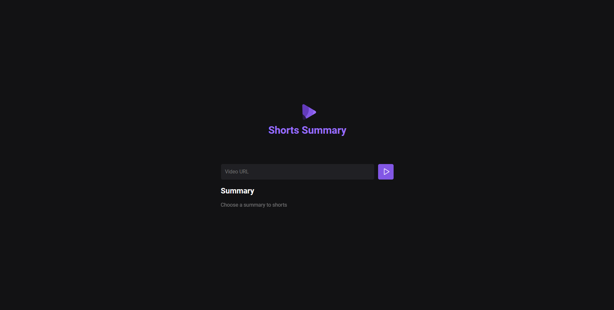

# Shorts Summary


**Shorts Summary** is a web application designed to create summaries of YouTube shorts videos using Artificial Intelligence to transcribe the video content and generate summaries. This project was developed as part of a hands-on session during the NLW AI (Rocketseat).

## Credits

This project was developed based on the knowledge acquired through courses and educational materials provided by [rocketseat](https://www.rocketseat.com.br). Rockseat offers a wide range of high-quality courses and content for developers in various areas, including design, programming, and app development.

We would like to thank the Rockseat team for providing valuable educational resources that contributed to the development of this project.

For more information about the courses and materials offered by Rockseat, please visit the official website at [rocketseat](https://www.rocketseat.com.br).

🎨 [Figma do projeto](https://www.figma.com/community/file/1282823495335498952/shorts-summary-trilha-foundations)

## Technology

The following are the key technologies and tools used in the development of this project:

### Server & Web

- **Vite**: Is a fast build tool for modern web development. It serves as a lightning-fast development server and optimized build tool.
- **Phosphor Icons**: Is a collection of open-source icons designed for use in web projects. It offers a wide range of icons covering various categories.
- **Express**: Is a minimalist web framework for Node.js. It simplifies the process of building web applications and APIs by providing a robust set of features.
- **Cors**: Is a Node.js package that enables Cross-Origin Resource Sharing for Express.js, allowing secure communication between different domains.
- **Axios**: Is a popular Promise-based HTTP client for JavaScript. It simplifies making HTTP requests from both the browser and Node.js environments.
- **Ydtl Core**: Is likely a library or module related to YouTube Downloader Core, possibly used for downloading YouTube videos.
- **Whisper**: Is a library or tool whose function isn't immediately clear from the name alone. It could be related to messaging, notifications, or secure communication.
- **Node Wav**: Is probably a Node.js module for working with WAV (Waveform Audio File Format) audio files, providing functionalities such as reading, writing, and manipulating WAV files.
- **Ffmpeg**: Is a powerful multimedia framework used for decoding, encoding, transcoding, and streaming audio and video files. It's often used for manipulating multimedia data.
- **@xenova/transformers**: Is likely a package related to transformers, a type of deep learning model architecture often used in natural language processing tasks such as text generation, translation, and summarization.

## Screenshots

### Web

#### Home



## Installation

To run the app locally, follow these steps:

Clone the repository:

```bash
git clone git@github.com:edsoncamargo/nlw-shorts-summary-ia.git
cd your-path/nlw-shorts-summary-ia
```

Next, follow the steps below:

### Server & Web

1. Install the dependencies:

```bash
   npm install
```

2. Start the web:

```bash
   npm run web
```

2. Start the server:

```bash
   npm run server
```

## Contribution

You are welcome to contribute to the development of this project. If you find bugs, wish to add new features, or improve usability, feel free to open an issue or submit a pull request.

## Contact

- Name: Edson Camargo Menezes
- Email: contact@edsoncamargo.dev

## Acknowledgments

Special thanks to everyone who contributed to making this app a reality, especially Rocketseat for their invaluable support and guidance throughout the development process. Your expertise and dedication have been instrumental in bringing this project to fruition.

Enjoy using **Shorts Summary!**
